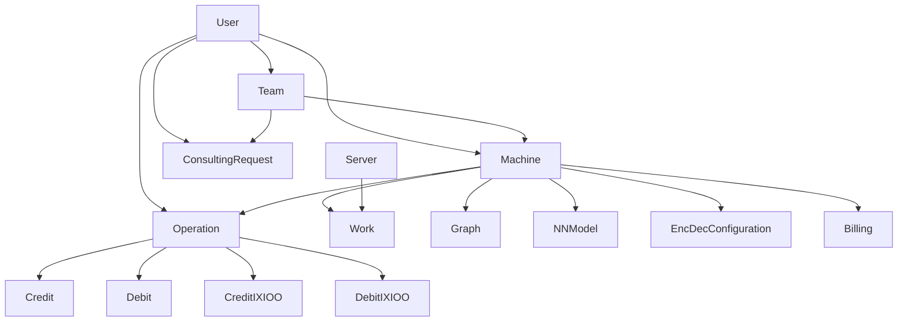

# Django Models Documentation

## Overview

This document provides comprehensive documentation for the Django models used in the EasyAutoML platform. The models are organized in a shared `models` package that serves both the ML components and the web application.

## Table of Contents

1. [Architecture Overview](#architecture-overview)
2. [Core Models](#core-models)
3. [User Management Models](#user-management-models)
4. [Machine Learning Models](#machine-learning-models)
5. [Billing Models](#billing-models)
6. [Infrastructure Models](#infrastructure-models)
7. [Service Models](#service-models)
8. [Model Relationships](#model-relationships)
9. [Database Configuration](#database-configuration)
10. [Usage Examples](#usage-examples)

## Architecture Overview

The Django models package (`models/`) is designed as a shared component that can be used independently from the web application. It includes:

- **Lazy imports** to avoid circular dependencies
- **Minimal Django settings** for standalone usage
- **Custom user model** with email-based authentication
- **Comprehensive machine learning workflow** support
- **Multi-tenant billing system**
- **Team-based collaboration** features

### Key Features

- **Email-based authentication** instead of username
- **Multi-currency billing** (USD and EAML tokens)
- **Machine learning pipeline** management
- **Team collaboration** with permissions
- **Marketplace functionality** for data and models
- **Consulting services** integration

## Core Models

### User Model

**File:** `models/user.py`

The custom User model extends Django's AbstractBaseUser and PermissionsMixin to provide email-based authentication with comprehensive user management features.

#### Authentication Fields
```python
# Primary authentication field (replaces username)
email = models.EmailField(
    null=True,
    unique=True,
    validators=[EmailValidator()],
    help_text="Primary email address for authentication"
)

# Personal information
first_name = models.CharField(max_length=140, null=True, blank=True)
last_name = models.CharField(max_length=140, null=True, blank=True)
user_profile = models.TextField(
    null=True,
    blank=True,
    help_text="User profile description and preferences"
)
```

#### User Preferences and Localization
```python
# Time and date formatting preferences
time_format = models.CharField(
    max_length=3,
    default="24H",
    choices=[("12H", "12 Hour"), ("24H", "24 Hour")],
    help_text="Preferred time format display"
)

date_format = models.CharField(
    max_length=3,
    default="DMY",
    choices=[("DMY", "Day-Month-Year"), ("MDY", "Month-Day-Year")],
    help_text="Preferred date format display"
)

date_separator = models.CharField(
    max_length=1,
    default="/",
    choices=[("/", "Slash"), ("-", "Dash"), (".", "Dot")],
    help_text="Date component separator"
)

datetime_separator = models.CharField(
    max_length=1,
    default=" ",
    choices=[(" ", "Space"), ("T", "T separator")],
    help_text="Date-time separator"
)

decimal_separator = models.CharField(
    max_length=1,
    default=",",
    choices=[(",", "Comma"), (".", "Dot")],
    help_text="Decimal number separator"
)
```

#### Financial Fields (Multi-Currency Support)
```python
# USD balance for platform services
user_balance = models.DecimalField(
    max_digits=20,
    decimal_places=8,
    default=Decimal('0'),
    validators=[MinValueValidator(Decimal('0'))],
    help_text="USD balance for platform usage"
)

# EAML token balance for premium features
user_ixioo_balance = models.DecimalField(
    max_digits=20,
    decimal_places=8,
    default=Decimal('0'),
    validators=[MinValueValidator(Decimal('0'))],
    help_text="EAML token balance for advanced features"
)

# Promotional credits
coupon_balance = models.DecimalField(
    max_digits=20,
    decimal_places=8,
    default=Decimal('0'),
    validators=[MinValueValidator(Decimal('0'))],
    help_text="Promotional coupon balance"
)
```

#### Administrative and Status Fields
```python
# Administrative roles
is_super_admin = models.BooleanField(
    default=False,
    help_text="Super administrator with full system access"
)
is_staff = models.BooleanField(
    default=False,
    help_text="Staff member with administrative access"
)
is_active = models.BooleanField(
    default=True,
    help_text="Active user account status"
)

# Audit fields (automatically managed)
date_joined = models.DateTimeField(auto_now_add=True)
last_login = models.DateTimeField(null=True, blank=True)
```

#### Key Methods

- `get_full_name()`: Returns formatted full name
- `get_user_teams()`: Returns all teams the user belongs to
- `create_team(team_name)`: Creates a new team with the user as admin
- `get_super_admin()`: Class method to get the super admin user

#### UserManager

Custom manager that handles user creation with email-based authentication:

```python
def create_user(self, email=None, password=None, **extra_fields)
def create_superuser(self, email, password, first_name=None, last_name=None, **extra_fields)
```

### Team Model

**File:** `models/team.py`

Manages team-based collaboration with permission-based access control.

#### Key Fields

```python
name = models.CharField(max_length=200)
admin_user = models.ForeignKey(User, null=True, on_delete=models.CASCADE)
users = models.ManyToManyField(User, related_name="Teams", blank=True)
url = models.URLField(unique=True, default=None, null=True)
permission = models.OneToOneField(Permission, on_delete=models.CASCADE, null=True)
```

#### Key Methods

- `add_user_to_team(user)`: Adds user to team and grants permissions
- `remove_user_from_team(user)`: Removes user and revokes permissions
- `generate_link()`: Creates unique team invitation link
- `create_permission()`: Creates team-specific permission

## Machine Learning Models

### Machine Model

**File:** `models/machine.py`

The central model for machine learning workflows, representing datasets and trained models.

#### Key Fields

```python
# Basic information
machine_name = models.CharField(max_length=500, blank=False)
machine_description = models.TextField(blank=True)
machine_level = models.IntegerField(default=1, choices=[(1,1), (2,2), (3,3), (4,4), (5,5)])

# Ownership
machine_owner_user = models.ForeignKey(User, on_delete=models.CASCADE)
machine_owner_team = models.ForeignKey(Team, on_delete=models.SET_NULL, null=True)

# Marketplace
machine_data_source_is_public = models.BooleanField(default=False)
machine_data_source_price_usd = models.DecimalField(max_digits=20, decimal_places=8)
machine_api_solving_is_public = models.BooleanField(default=False)
machine_api_solving_price_usd = models.DecimalField(max_digits=20, decimal_places=8)

# Column configuration
dfr_columns_type_user_df = models.JSONField(default=dict, blank=True)
mdc_columns_name_input = models.JSONField(default=dict, blank=True)
mdc_columns_name_output = models.JSONField(default=dict, blank=True)
mdc_columns_data_type = models.JSONField(default=dict, blank=True)

# Neural network configuration
parameter_nn_loss = models.CharField(max_length=100, choices=[('mse', 'mse'), ('mae', 'mae'), ('binary_crossentropy', 'binary_crossentropy')])
parameter_nn_optimizer = models.CharField(max_length=150, choices=[('adam', 'adam'), ('sgd', 'sgd'), ('rmsprop', 'rmsprop')])
parameter_nn_shape = models.JSONField(null=True, blank=True, default=dict)

# Training results
training_nn_model = models.OneToOneField('NNModel', related_name="machine_nn_model", on_delete=models.SET_NULL)
training_eval_loss_sample_training = models.DecimalField(max_digits=20, decimal_places=8)
training_eval_accuracy_sample_training = models.DecimalField(max_digits=20, decimal_places=8)
```

#### Key Properties

- `training_nn_model_extfield`: Property to access/set the neural network model binary data

#### Key Methods

- `save()`: Custom save method with validation and related model handling

### NNModel Model

**File:** `models/nn_model.py`

Stores trained neural network models as binary data.

```python
nn_model = models.BinaryField(null=True, blank=True, max_length=750000000)
```

### EncDecConfiguration Model

**File:** `models/encdec_configuration.py`

Stores encoding/decoding configuration for data preprocessing.

```python
enc_dec_config = models.JSONField(default=dict, blank=True, null=True)
```

### Graph Model

**File:** `models/graph.py`

Manages data visualization configurations for machine learning datasets.

#### Key Fields

```python
machine = models.ForeignKey(Machine, on_delete=models.CASCADE)
graph_type = models.IntegerField(default=1, choices=GRAPH_TYPES)
hue = models.CharField(max_length=255, null=True, default="Light24")
x = models.CharField(max_length=255, null=True, blank=True)
y = models.CharField(max_length=255, null=True, blank=True)
size = models.CharField(max_length=255, null=True, blank=True)
style = models.CharField(max_length=255, null=True, blank=True)
col = models.CharField(max_length=255, null=True, blank=True)
row = models.CharField(max_length=255, null=True, blank=True)
```

#### Graph Types

The model supports 13 different graph types including scatterplots, timeseries, histograms, and more.

## Billing Models

### Operation Model

**File:** `models/billing.py`

Central model for tracking all billing operations with UUID primary key.

#### Key Fields

```python
id = models.UUIDField(primary_key=True, editable=False, default=uuid4)
machine = models.ForeignKey(Machine, on_delete=models.SET_NULL, null=True)
machine_owner = models.ForeignKey(User, on_delete=models.SET_NULL, null=True)
operation_user = models.ForeignKey(User, on_delete=models.SET_NULL, null=True)

# Operation types
is_training_operation = models.BooleanField(default=False)
is_solving_operation = models.BooleanField(default=False)
is_solving_with_api_operation = models.BooleanField(default=False)
is_solving_with_api_market_operation = models.BooleanField(default=False)
is_buy_data_source_operation = models.BooleanField(default=False)
is_machine_copy_operation = models.BooleanField(default=False)
is_machine_copy_update_operation = models.BooleanField(default=False)
is_credit_from_user_operation = models.BooleanField(default=False)
is_pay_a_bill_operation = models.BooleanField(default=False)

# Metrics
count_of_lines = models.IntegerField(blank=True, null=True)
count_of_training_epoch = models.IntegerField(blank=True, null=True)
```

#### Related Models

- **Credit**: User balance credit transactions
- **Debit**: User balance debit transactions  
- **CreditIXIOO**: EAML token credit transactions
- **DebitIXIOO**: EAML token debit transactions

### Billing Model (Legacy)

**File:** `models/machine_billing.py`

Legacy billing model with comprehensive operation tracking.

#### Key Fields

```python
machine = models.ForeignKey(Machine, on_delete=models.CASCADE, null=True)
machine_owner_user = models.ForeignKey(User, on_delete=models.CASCADE, null=True)
Operation_User = models.ForeignKey(User, on_delete=models.CASCADE, null=True)

# Training operations
OperationIsTraining = models.BooleanField(null=True, blank=True)
CountOfLinesTraining = models.IntegerField(blank=True, null=True)
TrainingCostMachineUSD = models.DecimalField(max_digits=20, decimal_places=8)

# Solving operations
OperationIsSolving = models.BooleanField(null=True, blank=True)
CountOfLinesSolvedOwner = models.IntegerField(blank=True, null=True)
SolvingCostMachineUSD = models.DecimalField(max_digits=20, decimal_places=8)

# API operations
OperationIsSolvingAPI = models.BooleanField(null=True, blank=True)
CountOfLinesSolvedAPI = models.IntegerField(null=True, blank=True)
SolvingAPIIncomeUSD = models.DecimalField(max_digits=20, decimal_places=8)
```

## Infrastructure Models

### Server Model

**File:** `models/server.py`

Manages server resources for machine learning processing.

```python
server_name = models.CharField(max_length=50, unique=True)
server_date_time = models.DateTimeField(auto_now_add=True)
server_info_ready = models.BooleanField(null=True, blank=True)
server_gpu_ram = models.JSONField(default=list, blank=True)
```

### Work Model

**File:** `models/work.py`

Tracks work items for machine learning processing on servers.

#### Key Fields

```python
machine = models.ForeignKey(Machine, related_name="Work", on_delete=models.CASCADE)
server = models.ForeignKey(Server, on_delete=models.CASCADE, null=True)

# Work types
is_work_training = models.BooleanField(null=True, blank=True)
is_work_solving = models.BooleanField(null=True, blank=True)

# Status tracking
is_work_status_wait_for_server_start = models.BooleanField(null=True, blank=True)
is_work_status_server_processing = models.BooleanField(null=True, blank=True)
is_work_status_server_finished = models.BooleanField(null=True, blank=True)
is_work_status_server_error = models.BooleanField(null=True, blank=True)

# Timing
work_started_at_date_time = models.DateTimeField(auto_now=True)
work_finished_at_date_time = models.DateTimeField(null=True, blank=True)
work_duration_estimation_seconds = models.DecimalField(max_digits=20, decimal_places=8)
```

### DataLinesOperation Model

**File:** `models/data_lines_operation.py`

Tracks data line operations for machine learning workflows.

```python
machine_id = models.IntegerField()
is_added_for_learning = models.BooleanField(null=True, blank=True)
is_added_for_solving = models.BooleanField(null=True, blank=True)
```

### MachineTableLockWrite Model

**File:** `models/machine_table_lock_write.py`

Provides table-level locking mechanism for concurrent operations.

```python
table_name = models.CharField(max_length=255, unique=True)
locked_at = models.DateTimeField(default=timezone.now)
```

## Service Models

### ConsultingRequest Model

**File:** `models/consulting.py`

Manages consulting service requests and contracts.

#### Key Fields

```python
user = models.ForeignKey(User, on_delete=models.SET_NULL, null=True)
team = models.ForeignKey(Team, on_delete=models.CASCADE, null=True)
category = models.CharField(max_length=1, choices=CATEGORIES)
description = models.TextField(blank=True)
file = SizedBinaryField(size_class=3, null=True, blank=True)
machine = models.ForeignKey(Machine, on_delete=models.CASCADE, null=True)

# Status tracking
is_status_request_open = models.BooleanField(blank=True, null=True)
is_status_waiting_consultant_approval = models.BooleanField(blank=True, null=True)
is_status_contract = models.BooleanField(blank=True, null=True)
is_status_contract_finished = models.BooleanField(blank=True, null=True)

# Contract details
consultant_user = models.ForeignKey(User, on_delete=models.CASCADE, related_name="Consultant_User", null=True)
amount_usd = models.IntegerField(null=True, blank=True)
budget_estimation = models.FloatField(null=True, blank=True)
delay_days = models.IntegerField(null=True, blank=True)
```

#### Categories

- "1": Data Engineering
- "2": Machine performance  
- "3": API Integration
- "4": Other

### EasyAutoMLLogger Model

**File:** `models/logger.py`

Centralized logging system for the platform.

```python
timestamp = models.DateTimeField(auto_now_add=True)
traceback = models.TextField(blank=True)
level = models.TextField()
logger = models.TextField()
main_module = models.TextField()
main_function = models.TextField()
message = models.TextField(blank=True)
host_name = models.TextField()
ip = models.TextField()
```

## Model Relationships

### Primary Relationships



### Key Relationships

1. **User ↔ Team**: Many-to-many relationship with Team having an admin user
2. **User → Machine**: One-to-many (user owns machines)
3. **Team → Machine**: One-to-many (team can own machines)
4. **Machine → Work**: One-to-many (machine can have multiple work items)
5. **Server → Work**: One-to-many (server processes multiple work items)
6. **Machine → NNModel**: One-to-one (machine has one trained model)
7. **Machine → EncDecConfiguration**: One-to-one (machine has one encoding config)
8. **Operation → Credit/Debit**: One-to-one relationships for billing

## Database Configuration

### Settings

**File:** `models/settings.py`

Minimal Django settings for standalone model usage:

```python
# Custom user model
AUTH_USER_MODEL = 'models.User'

# Decimal field defaults
MODEL_DECIMAL_FIELD_DEFAULT_MAX_DIGITS = 20
MODEL_DECIMAL_FIELD_DEFAULT_DECIMAL_PLACES = 8

# Database
DATABASES = {
    'default': {
        'ENGINE': 'django.db.backends.sqlite3',
        'NAME': BASE_DIR / 'db.sqlite3',
    }
}
```

### App Configuration

**File:** `models/apps.py`

```python
class ModelsConfig(AppConfig):
    default_auto_field = 'django.db.models.BigAutoField'
    name = 'models'
    label = 'models'
    verbose_name = 'Shared Models'
```

### Lazy Loading

**File:** `models/__init__.py`

The package uses lazy imports to avoid circular dependencies:

```python
def __getattr__(name):
    """Lazy import models to avoid circular dependencies"""
    if name == 'User':
        from .user import User
        return User
    # ... other models
```

## Usage Examples

### Creating a User

```python
from models import User

# Create regular user
user = User.objects.create_user(
    email='user@example.com',
    password='secure_password',
    first_name='John',
    last_name='Doe'
)

# Create superuser
admin = User.objects.create_superuser(
    email='admin@example.com',
    password='admin_password',
    first_name='Admin',
    last_name='User'
)
```

### Creating a Team

```python
from models import Team

# Create team
team = Team.objects.create(
    name='Data Science Team',
    admin_user=user
)
team.create_permission()
team.users.add(user)
```

### Creating a Machine

```python
from models import Machine

# Create machine
machine = Machine.objects.create(
    machine_name='Customer Churn Prediction',
    machine_description='Predict customer churn using historical data',
    machine_owner_user=user,
    machine_owner_team=team,
    machine_level=3
)

# Configure columns
machine.dfr_columns_type_user_df = {
    'customer_id': 'LABEL',
    'age': 'FLOAT',
    'income': 'FLOAT',
    'churn': 'LABEL'
}
machine.save()
```

### Creating Work Items

```python
from models import Work, Server

# Get available server
server = Server.objects.filter(server_info_ready=True).first()

# Create training work
work = Work.objects.create(
    machine=machine,
    server=server,
    is_work_training=True,
    is_work_status_wait_for_server_start=True
)
```

### Billing Operations

```python
from models import Operation, Credit

# Create training operation
operation = Operation.objects.create(
    machine=machine,
    machine_owner=machine.machine_owner_user,
    operation_user=user,
    is_training_operation=True,
    count_of_lines=1000,
    count_of_training_epoch=50
)

# Create credit transaction
credit = Credit.objects.create(
    user=user,
    amount=100.00
)
operation.credit = credit
operation.save()
```

### Querying Examples

```python
# Get user's machines
user_machines = Machine.objects.filter(machine_owner_user=user)

# Get team machines
team_machines = Machine.objects.filter(machine_owner_team=team)

# Get pending work
pending_work = Work.objects.filter(
    is_work_status_wait_for_server_start=True
)

# Get user's billing history
user_operations = Operation.objects.filter(operation_user=user)

# Get machine's training history
machine_work = Work.objects.filter(
    machine=machine,
    is_work_training=True
)
```

## Best Practices

### Model Usage

1. **Always use lazy imports** when importing models to avoid circular dependencies
2. **Use the custom User model** for all authentication
3. **Leverage JSON fields** for flexible column configurations
4. **Use UUID primary keys** for billing operations to ensure uniqueness
5. **Implement proper validation** in model save methods

### Performance Considerations

1. **Use database indexes** for frequently queried fields
2. **Consider JSON field queries** for complex filtering
3. **Use select_related** for foreign key relationships
4. **Implement proper caching** for frequently accessed data

### Security Considerations

1. **Validate user permissions** before allowing machine operations
2. **Use proper CASCADE/SET_NULL** for foreign key deletions
3. **Implement team-based access control** for sensitive operations
4. **Log all billing operations** for audit trails

## Migration Notes

When working with these models:

1. **Run migrations** after model changes
2. **Backup data** before major schema changes
3. **Test lazy imports** to ensure no circular dependencies
4. **Validate foreign key constraints** after migrations

## Conclusion

The Django models package provides a comprehensive foundation for the EasyAutoML platform, supporting:

- **Multi-tenant user management** with team collaboration
- **Complete machine learning workflow** from data ingestion to model deployment
- **Flexible billing system** with multiple currencies
- **Scalable infrastructure** for distributed processing
- **Professional services** integration

The modular design allows for independent usage while maintaining strong relationships between components, making it suitable for both standalone ML operations and integrated web applications.


